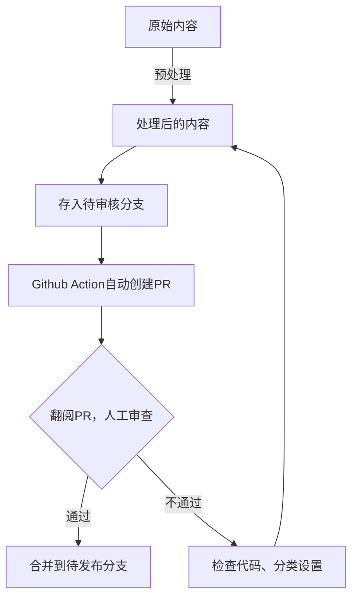

---
category:
- blog
date: 2024-12-21
isOriginal: true
tags:
- 工作流
- Vuepress
- Obsidian
title: 我的博客发布流程
---
## 前言
在我使用了一段时间 Obsidian 后，随着内容产出的增多，我很需要一个地方满足自己的分享欲，并且也方便别人找到我，而不是甩一个b站主页上去。

作为一个折腾爱好者，能交给计算机干的绝对不会自己干。既然是都用 Obsidian 了，那双链等自然是必不可少的。同时，作为一个 All in one爱好者，ob仓库里面摆满了各种日记等隐私数据。自然，我不希望把它们分享出来。当然，博客自然要支持静态部署......

种种个性化需求，市面上没有博客框架能满足的了。因此，我一直在探索这方面的流程。经过大约两个月的折腾，整出了一套符合我需求的、方便的流程。现在在此把这一整套的流程分享出来。
## 发布流程
### 上传与存储
发布这种事情，自然是不能在本地处理了~~不然就不够自动化了~~。所以选择了[GitHub Actions](https://github.com/features/actions)作为CI/CD，帮我干这件苦差事。

那么，首先，我们要把数据传到Github上。

不得不感慨Obsidian生态的强大，只要安装Obsidian Git，配置一下，让它定时上传到仓库就行了。 ~~顺便当个备份用~~

### 预处理
刚刚上传的数据没有经过任何处理，肯定不能随随便便发出来。所以先塞到一个私有仓库中，进行一些预处理。

这边，我选择了Python代码，用一些正则表达式，自动将 `[]()` 类型的链接转换成Vuepress支持的 `[]()` 格式的链接，并且构建了一个双链的数据结构。


以及，Vuepress那边有个很难受的特性，公开资源一定要放在 `public` 文件夹中，不能直接方便的放在文件夹里面。~~并且我也不想建图床~~ 所以，还得再来一个处理，把图片啥的移动过去


顺手的事，还能处理一下`frontmatter`，把格式啥的转换一下。


> [!info] 代码链接
> [erduotong.github.io/scripts/vault_transform at main · erduotong/erduotong.github.io](https://github.com/erduotong/erduotong.github.io/tree/main/scripts/vault_transform)

### 审查
谁能保证自己的代码绝对没Bug呢？这些隐私数据，还是过目一下比较好。

最终，我选择了在Github中的Pull Request进行审查(虽然好像本来它就是干这个的)，分为两个分支，一个分支存储刚处理好的内容，一个分支存储审核过的内容。而Pull Request则交给Github Action自己打开。
> [!info] 如何在没新内容的情况下也打开一个PR
> 创建一个空提交，然后再开启PR就好啦


具体而言，就是下面这个过程:



这里附上我的Github Action
> [!info]- 工作流
> ```yaml
> name: 生成预览
> 
> on:
>   workflow_dispatch:
>   schedule: # 两日一次
>     - cron: '0 0 */2 * *'
> jobs:
>   build:
>     runs-on: ubuntu-latest
> 
>     steps:
>       - name: Checkout repository
>         uses: actions/checkout@v2
> 
>       - name: Set up Python
>         uses: actions/setup-python@v2
>         with:
>           python-version: 3.11
> 
>       - name: Install dependencies
>         run: |
>           python -m pip install --upgrade pip
>           pip install -r requirements.txt
> 
>       - name: Checkout Obsidian Data
>         uses: actions/checkout@v2
>         with:
>           repository: erduotong/obsidian_vault
>           ref: main
>           token: ${{ secrets.ACTION_TOKEN }}
>           path: obsidian_data
>           fetch-depth: 1
>       - name: Process Obsidian Data
>         run: |
>           cd obsidian_data
>           python ../scripts/vault_transform/main.py --path="./"
>           cd ..
>           ls -a
>       - name: Checkout wait_publish branch
>         uses: actions/checkout@v2
>         with:
>           repository: erduotong/some
>           ref: wait_publish
>           token: ${{ secrets.ACTION_TOKEN }}
>           path: wait_publish_data
>           fetch-depth: 1
> 
>       - name: Sync Obsidian Data to wait_publish
>         run: |
>           ls -a
>           git config --global user.email "actions@github.com"
>           git config --global user.name "Github Actions"
>           rm -rf wait_publish_data/*
>           cp -r obsidian_data/. wait_publish_data/
>           ls -a wait_publish_data
>           echo ...------....
>           ls -a obsidian_data
>           cd wait_publish_data
>           git config --global user.email "actions@github.com"
>           git config --global user.name "Github Actions"
>           ls -a
>           git add .
>           if git diff-index --quiet HEAD; then
>             echo "No changes to commit."
>             echo "is_empty=1" >> $GITHUB_ENV
>           else
>             git commit -m "Auto Update"
>             git push --force origin wait_publish
>             echo "is_empty=0" >> $GITHUB_ENV
>           fi
>       - name: Create a pull request
>         if: env.is_empty == '0'
>         env:
>           GH_TOKEN: ${{ secrets.ACTION_TOKEN }} #不存在才继续
>         run: |
>           PR_EXIST=$(gh pr list --state open --base publish --head wait_publish | wc -l)
>           if [ "$PR_EXIST" -eq 0 ]; then
>           gh pr create --base publish --head wait_publish --title '审查内容' --body '用于审查内容的PR，您可以在这里查看上一次更新至今的内容。若您认为内容无误，请merge PR，这将自动发布到您的博客'
>           else
>           echo "相同的拉取请求已经存在。"
>           fi
>             
> ```
### 部署
因为~~没钱购买服务器~~，还是选择了静态网站部署。也没什么特别需求，就用Github Page了。

内容，我们已经在[预处理](#预处理)阶段准备好了，接下来，就是把博客框架与内容进行合并。

这边经过长时间的对比，最终使用了Vuepress方案，并且调试好了配置文件，放在一个分支中。

最后，只差一步之遥了。

只需要拉取，合并，然后再调用一下部署github pages即可。
> [!warning] 一个很抽象的bug
> 以.开头的文件默认来说不会在Linux系统下主动被复制，详情见[一个＊引发的惨案](../debug记录/一个＊引发的惨案.md)

🎉 我们的博客已经发布成功啦，并且全流程中，除了安全审查，其他都是自动的！


> [!info]- 附上代码
> ```yaml
> name: 部署文档
> 
> on:
>   workflow_dispatch:
>   schedule:
>     - cron: '0 0 * * *'
> 
> 
> jobs:
>   merge:
>     name: Merge Notes
>     runs-on: ubuntu-latest
> 
>     steps:
>       - name: checkout code
>         uses: actions/checkout@v4
>         with:
>           path: main
>           ref: main
>       - name: checkout notes
>         uses: actions/checkout@v4
>         with:
>           repository: ${{secrets.NOTE_REPO}}
>           token: ${{secrets.WORKFLOW_TOKEN}}
>           path: notes_folder
>           ref: publish
>       - name: checkout merged
>         uses: actions/checkout@v4
>         with:
>           path: merged
>           ref: merged
>       - name: config git
>         run: |
>           git config --global user.name 'github-actions[bot]'
>           git config --global user.email 'github-actions[bot]@users.noreply.github.com'
> 
>       - name: merge and push
>         run: |
>           find merged -mindepth 1 -maxdepth 1 -type d ! -name '.git' -exec rm -rf {} +
>           
>           rsync -av --exclude='.git' main/ merged/
>           rsync -av --exclude='.git' notes_folder/ merged/src/
>           
>           cd merged
>           git add .
>           git commit -m "merge notes" || echo "nothing to commit"
>           git push
>           cd ..
>   build:
>     name: Build the Website
>     runs-on: ubuntu-latest
>     needs: merge
>     steps:
>       - name: Checkout
>         uses: actions/checkout@v4
>         with:
>           ref: merged
>       - name: Setup pnpm
>         uses: pnpm/action-setup@v2
>         with:
>           version: 9
>           run_install: true
> 
>       - name: Setup Node.js
>         uses: actions/setup-node@v4
>         with:
>           node-version: 21
>           cache: pnpm
>       - name: Build The Site
>         run: pnpm docs:build
>       - name: Add CNAME
>         run: echo 'blog.erduotong.com' > src/.vuepress/dist/CNAME
> 
>       - name: Deploy to GitHub Pages
>         uses: crazy-max/ghaction-github-pages@v4
>         with:
>           # 部署到 gh-pages 分支
>           target_branch: gh-pages
>           # 部署目录为 VuePress 的默认输出目录
>           build_dir: src/.vuepress/dist
>         env:
>           GITHUB_TOKEN: ${{ secrets.WORKFLOW_TOKEN}}
> ```

## 结语
希望这套博客发布的流程能给有相似需求的人一些参考。
如果有一些疑问，欢迎留言。