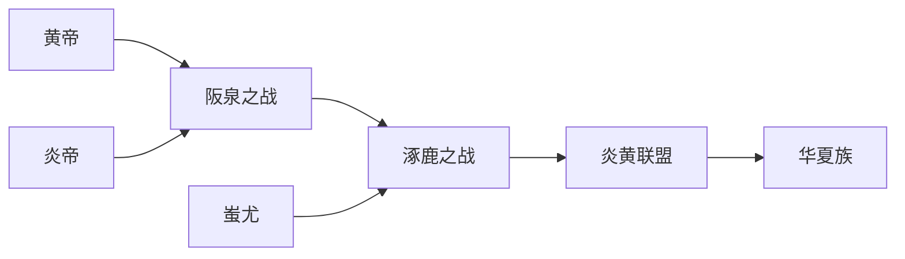

> [!info] 前置知识
> [3.5b 中国的传说时期](../../../../../../42 卡片笔记/主卡片/3.5b 中国的传说时期.md)
# 炎黄联盟
- `时间`: 五六千年前
- `位置`: 黄河流域
- `主要部落`: 
    - 炎帝部落
    - 黄帝部落
    - 蚩尤部落
## 部落联盟
- 部落间展开攻伐，又不断合并
- 进而结成部落联盟，并推举出部落联盟首领
## 部落联盟的形成过程

### 阪泉之战
- `地点`: 阪泉
- `联盟`
    - 黄帝联合一些联盟
    - 炎帝联盟
- `结果`: 炎帝失败，归顺黄帝，两大部落结成部落联盟 ^ktqvwp
### 涿鹿之战
- `地点`: 涿鹿
- `联盟`
    - [炎黄联盟](#^ktqvwp)
    - 东方的蚩尤联盟
- `结果`: 黄帝部落最终打败蚩尤 `黄帝部落的势力和声望大增 => 黄帝被推举为部落联盟首领`
- `意义`: 这一部落联盟逐渐形成**华夏族** `汉族的前生` ==> 因此炎帝和黄帝被尊崇为中华民族的**人文初祖**，海内外华人以“炎黄子孙”自称
# 炎帝与黄帝的发明
## 炎帝
- 开垦耕种
- 制作生产工具
- 种植五谷和蔬菜
- 制作陶器
- 发明纺织
- 煮盐
- 教人们交换物品
- 制作乐器琴瑟
- 并具有最早的天文和历法知识
## 黄帝
> 名*轩辕*

- 建造宫室
- 制作衣裳
- 挖掘水井
- 制造船只
- 炼铜
- 发明了弓箭
## 黄帝时期
- *仓颉*创造文字
- *伶伦*制作音律
- *隶首*发明算盘
- 黄帝的妻子*嫘祖*会缫丝，擅长纺织
## 彩陶
- 最早流行于河南西部、陕西关中地区、陕西南部接壤的地区
- 距今约5300年左右，彩陶文化影响范围达到黄河上游河下游、长江上中下游、辽河流域
- `意义`: 是中原地区的史前文化第一次向周围地区施加强烈的影响
## 意义
- 反映了我国原始社会晚期的社会发展水平
- 反映了人们在衣食住行等方面的发展和变化

# 尧舜禹的禅让
## 背景
- 相传黄帝之后，黄河流域有许多部族
- 为了增强实力，陶唐氏 有虞氏 夏后氏三个部族结成联盟，尧舜禹依次成为联盟的首领
## 禅让制
- 指将联盟首领的位子传给贤德之人
## 首领
### 尧
鼓励人们开垦农田，发展历法、适时耕种
### 舜
- 指定刑法，完善制度，稳定局势
- 派[禹](#禹)治水，解除水患
- 老时让位于禹
### 禹
- 父亲曾主持治理黄河水患，历经9年没有成功，后被处死
- 禹总结教训，采取**疏导**的方式，开凿河流疏导洪水入海
- 他全身心投入之水，曾“三过家门而不入”，消除了水患
- 他治水有功，受到民众爱戴，被尊称为“大禹”
- `精神`
    - 创新
    - 坚持不懈
    - 奉献
    - 敬业