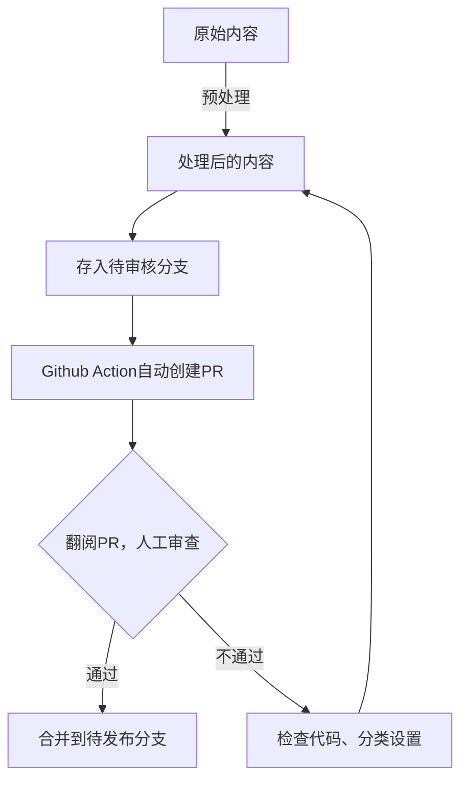

---
category:
- blog
date: '2024-12-21'
isOriginal: true
tags:
- 工作流
- Vuepress
- Obsidian
title: 我的博客发布流程
---
## 前言
在我使用了一段时间 Obsidian 后，随着内容产出的增多，我很需要一个地方满足自己的分享欲，并且也方便别人找到我，而不是甩一个b站主页上去。

作为一个折腾爱好者，能交给计算机干的绝对不会自己干。既然是都用 Obsidian 了，那双链等自然是必不可少的。同时，作为一个 All in one爱好者，ob仓库里面摆满了各种日记等隐私数据。自然，我不希望把它们分享出来。当然，博客自然要支持静态部署......

种种个性化需求，市面上没有博客框架能满足的了。因此，我一直在探索这方面的流程。经过大约两个月的折腾，整出了一套符合我需求的、方便的流程。现在在此把这一整套的流程分享出来。
## 发布流程
### 上传与存储
发布这种事情，自然是不能在本地处理了~~不然就不够自动化了~~。所以选择了[GitHub Actions](https://github.com/features/actions)作为CI/CD，帮我干这件苦差事。

那么，首先，我们要把数据传到Github上。

不得不感慨Obsidian生态的强大，只要安装Obsidian Git，配置一下，让它定时上传到仓库就行了。 ~~顺便当个备份用~~

### 预处理
刚刚上传的数据没有经过任何处理，肯定不能随随便便发出来。所以先塞到一个私有仓库中，进行一些预处理。

这边，我选择了Python代码，用一些正则表达式，自动将 `` 类型的链接转换成Vuepress支持的 `` 格式的链接，并且构建了一个双链的数据结构。

以及，Vuepress那边有个很难受的特性，公开资源一定要放在 `public` 文件夹中，不能直接方便的放在文件夹里面。~~并且我也不想建图床~~ 所以，还得再来一个处理，把图片啥的移动过去

顺手的事，还能处理一下`frontmatter`，把格式啥的转换一下。

> [!info] 代码链接
> [erduotong.github.io/scripts/vault_transform at main · erduotong/erduotong.github.io](https://github.com/erduotong/erduotong.github.io/tree/main/scripts/vault_transform)

### 审查
谁能保证自己的代码绝对没Bug呢？这些隐私数据，还是过目一下比较好。

最终，我选择了在Github中的Pull Request进行审查(虽然好像本来它就是干这个的)，分为两个分支，一个分支存储刚处理好的内容，一个分支存储审核过的内容。而Pull Request则交给Github Action自己打开。

具体而言，就是下面这个过程:

### 部署